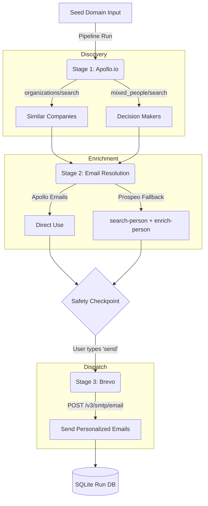
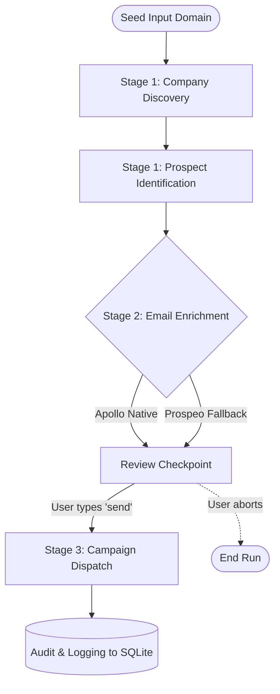

<div align="center">
  <h1>Subspace Cold Outreach Pipeline</h1>
  <p><i>A fully automated cold‑outreach pipeline — production‑ready, secure, scalable, well‑tested, and documented.</i></p>

  <p align="center">
    <a href="#-overview">Overview</a> •
    <a href="#-architecture">Architecture</a> •
    <a href="#-database-system">Database</a> •
    <a href="#-flow-of-working">Workflow</a> •
    <a href="#-quickstart">Quickstart</a> •
    <a href="#-api-services">API Services</a> •
    <a href="#-contributing">Contributing</a>
  </p>
</div>

---

## 📖 Overview

Outpilot is an asynchronous, type-safe cold-outreach automation engine built for scale. It orchestrates the entire process of B2B prospect discovery, email enrichment, and automated campaign execution using industry-leading tools like Apollo.io, Prospeo, and Brevo. 

## 🏗️ Architecture

The application relies on a modular architecture to sequentially process domain inputs into validated contacts and eventually dispatched outreach emails.



## 💾 Database System

Outpilot leverages **SQLModel** (Pydantic + SQLAlchemy) with **aiosqlite** for fast, asynchronous, and type-safe database operations.

- **Dynamic Run Stores**: Instead of a monolithic database, the pipeline creates isolated SQLite databases for each execution (`runs/{run_id}.db`). This prevents data pollution and ensures isolated state.
- **Tables**:
  - `runs`: Tracks pipeline execution status and seed domain.
  - `companies`: Stores discovered lookalike companies.
  - `prospects`: Holds raw decision-maker profiles.
  - `contacts`: Stores enriched and verified email profiles.
  - `outreach_records`: Logs dispatched emails and Brevo message IDs.


## 🔄 Flow of Working



The system progresses linearly from the initial target domain to final dispatch. It identifies lookalike companies, scrapes decision-makers, enriches contact details (falling back to Prospeo if Apollo fails), asks for user confirmation, and finally logs the sent emails to a unique SQLite database.

---

## 🚀 Quickstart

```bash
# 1. Install dependencies using uv package manager
uv sync

# 2. Configure environment variables
cp .env.example .env

# 3. Perform a dry run (resolves emails but does NOT send them)
uv run python -m pipeline run stripe.com --dry-run

# 4. Perform a live run
uv run python -m pipeline run stripe.com
```

## 🛠️ Commands

| Command | Description |
|---------|-------------|
| `uv run python -m pipeline run <domain>` | Execute the full pipeline |
| `uv run python -m pipeline run <domain> --dry-run` | Execute stages 1‑3 without sending emails |
| `uv run python -m pipeline list-runs` | List past pipeline execution runs |
| `uv run python -m pipeline status <run_id>` | Show detailed status for a specific run |

## 🔌 API Services

| Service | Purpose | Auth Header |
|---------|---------|-------------|
| **Apollo.io** | Companies + people search | `x-api-key` |
| **Prospeo** | Email enrichment fallback | `X-KEY` |
| **Brevo** | Transactional email delivery | `api-key` |

### Free Tier Limits
- **Apollo.io**: The free plan may block `/mixed_people/search` with a 403 error.
- **Prospeo**: Check available credits before executing bulk runs.
- **Brevo**: Approximately 300 emails/day on the free tier (enforced locally by `DAILY_EMAIL_CAP`).

## 👨‍💻 Development

```bash
# Run tests with coverage reporting
uv run pytest tests/ --cov=src --cov-report=term-missing

# Lint the codebase
uv run ruff check src/ tests/

# Type check
uv run mypy src/ --strict

# Security scan
uv run bandit -r src/ -ll
```

## 🥞 Tech Stack

- **Python 3.12+**
- **Package Manager**: `uv`
- **Database ORM**: `Pydantic v2` + `SQLModel` + `aiosqlite`
- **Network**: `httpx` + `asyncio` + `tenacity`
- **CLI Framework**: `Typer` + `Rich`
- **Testing & QA**: `pytest`, `respx`, `pytest‑asyncio`, `ruff`, `mypy`, `bandit`

## 🤝 Contributing

Contributions are welcome!
1. Fork the repository.
2. Create a feature branch (`git checkout -b feature/awesome-feature`).
3. Install dependencies (`uv sync`).
4. Ensure tests pass (`uv run pytest`).
5. Submit a pull request.

---
*Generated by Outpilot – your trusted cold‑outreach automation engine.*
